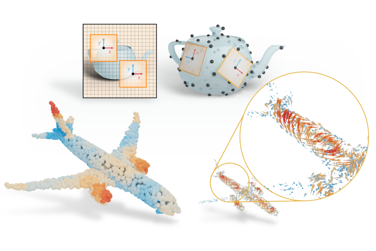
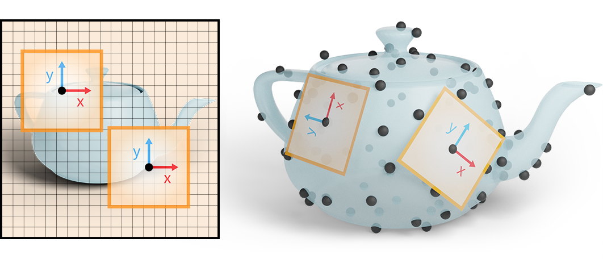

## SEFI 2024
# Mixed Reality for Experimental knowledge learning
[Qinglan Shan](https://qinglanshan.com/)<sup>1</sup>

## Keywords
Augmented reality, engineering education, interactive learning environments, mixed reality, microfabrication, embodied learning

## Abstract
We are developing a new approach to leverage Mixed Reality (MR) affordances for teaching microfabrication processes, such as performed in a cleanroom. Our goal is to design interactive MR content to improve microfabrication and cleanroom training practices. MR presents a promising avenue as it allows hands-free interaction with the system and diminishes cognitive load when learning complex content. We incorporate diverse learning techniques such as real-time feedback, scaffolding, simulations,inquiries, and multimodal interactions to enhance the efficacy and feasibility of educational practices in the design of applications. In a course about microfabrication in bachelor curriculum, we carried out hands-on training sessions in a real cleanroom environment. By the end of the course, five students completed their experiments. We observed that MR was effective in customizing learning experiences and increasing student engagement. Additionally, MR proved helpful for teaching assistants in clarifying complex concepts and phenomena related to the fabrication tools during practical sessions. Although the small sample size limits our ability to draw definitive conclusions, initial qualitative assessments and post-training evaluations suggest that integrating MR into practical engineering education holds great promise.

## PDF
The conference still need some time to publish the proceedings. You could check the paper through this [link](https://www.conftool.net/sefi2024/index.php?page=browseSessions&print=export&ismobile=false&form_session=577&mode=table&presentations=show). 

<!--
[Ahmad Nasikun](https://graphics.tudelft.nl/ahmad-nasikun/)<sup>1, 2</sup>, [Elmar Eisemann](http://graphics.tudelft.nl/~eisemann/)<sup>1</sup>, and [Klaus Hildebrandt](http://graphics.tudelft.nl/~klaus/)<sup>1</sup><br />
<sup>1</sup>Delft University of Technology, <sup>2</sup>Universitas Gadjah Mada



<a id="github-link"
      class="icon" title="DeltaConv Github Repo" aria-label="Github Project"
      href="https://github.com/rubenwiersma/deltaconv" target="_blank">
    <i class="fa fa-2x fa-github"></i> Code</a>&nbsp;&nbsp;
<a id="pdf-link"
      class="icon" title="DeltaConv PDF" aria-label="PDF link"
      href="/assets/pdf/DeltaConv.pdf" target="_blank">
    <i class="fa fa-2x fa-file-pdf-o"></i> Paper PDF</a>&nbsp;&nbsp;
<a id="pdf-link"
      class="icon" title="DeltaConv supplement PDF" aria-label="PDF link"
      href="/assets/pdf/DeltaConv_supplement.pdf" target="_blank">
    <i class="fa fa-2x fa-file-pdf-o"></i> Supplement PDF</a>&nbsp;&nbsp;
<a id="cite-link"
      class="icon" title="Cite" aria-label="Cite"
      href="#cite">
    <i class="fa fa-2x fa-quote-right"></i> Cite</a>&nbsp;&nbsp;
<a id="replication-link"
      class="icon" title="Replicability Stamp" aria-label="Replicability Stamp"
      href="http://www.replicabilitystamp.org/#https-github-com-rubenwiersma-deltaconv">
    <i class="fa fa-2x fa-star-o"></i> Replicability Stamp</a>


<iframe width="560" height="315" src="https://www.youtube.com/embed/pKVtuz4dG0g" title="YouTube video player" frameborder="0" allow="accelerometer; autoplay; clipboard-write; encrypted-media; gyroscope; picture-in-picture" style="margin: 50px auto" allowfullscreen></iframe>

## Summary
Anisotropic convolution is a central building block of CNNs but challenging to transfer to surfaces: Consider a CNN on images. Because an image has a globally consistent up-direction, the network can build anisotropic filters that activate the same way across the image.



Because we do not have a global coordinate system on surfaces, one cannot build and use anisotropic filters in the same way as on images. This limits current intrinsic convolutions on point clouds.

### DeltaConv

DeltaConv is described in terms of geometric operators instead of kernels. A well known operator that has been used widely in geometric deep learning is the Laplacian. While the Laplacian is a natural fit for intrinsic learning on surfaces, it is isotropic.

A classical way of creating anisotropic operators is to write the Laplacian as the divergence of the gradient and apply a linear or non-linear operation on the intermediate vector field. DeltaConv builds on this idea by constructing learnable anisotropic operators from elemental geometric operators: the gradient, co-gradient, divergence, curl, Laplacian, and Hodge-Laplacian. Because the operators output scalars and vectors, DeltaConv splits into a scalar- and vector stream.


- **DeltaConv is anisotropic** The building blocks of DeltaConv allow it to construct anisotropic operators. A simple architecture with only a few DeltaConv blocks demonstrates state-of-the-art performance on several benchmarks.

- **DeltaConv is easy to implement** You only need two sparse matrices that represent gradient and divergence. Everything else can be implemented with matrix multiplication and standard MLPs. Our implementation is [available on github](https://github.com/rubenwiersma/deltaconv) and you can install it with pip: `pip install deltaconv`.

- **DeltaConv generalizes across representations** We implemented DeltaConv for point clouds and images, but the building blocks generalize to other representations. For example, an implementation for meshes could use finite element discretizations or discrete exterior calculus.

- **DeltaConv is coordinate-independent** Because each geometric operator is coordinate-independent, the network as a whole is independent to local choices of coordinate systems.

- **DeltaConv is isometry invariant** DeltaConv inherits orientation-preserving isometry-invariance from the geometric operators. It's simple to make DeltaConv invariant to orientation flips as well: simply remove the co-gradient and curl operators.

The result is an intrinsic and anisotropic convolution layer that can be used in typical neural architectures for learning on point clouds.

## Results

DeltaConv achieves state-of-the-art results in a simple architecture: **93.8% accuracy** on ModelNet40, **86.9mIoU** on ShapeNet, and **84.7% accuracy** on the most difficult variant of ScanObjectNN. Meanwhile, it's faster than previous edge-based convolutions, because it represents directional features at points instead of edges.

A simple example on images illustrates the difference with other convolution layers for point clouds. We apply a classical anisotropic diffusion operator (Perona-Malik) on images and overfit a ResNet with different convolution layers on the result. DeltaConv is able to approximate the anisotropic diffusion process and is also able to mimic different diffusion times, where other convolutions struggle.


*Courtesy [NASA](https://www.flickr.com/photos/nasacommons/16504233985/).*

## Learn more

Find out more about DeltaConv in our paper, or come see our (virtual) presentation at SIGGRAPH 2022.

<a id="github-link"
      class="icon" title="DeltaConv Github Repo" aria-label="Github Project"
      href="https://github.com/rubenwiersma/deltaconv" target="_blank">
    <i class="fa fa-2x fa-github"></i> Code</a>&nbsp;&nbsp;
<a id="pdf-link"
      class="icon" title="HSN PDF" aria-label="PDF link"
      href="/assets/pdf/DeltaConv.pdf" target="_blank">
    <i class="fa fa-2x fa-file-pdf-o"></i> Paper PDF</a>&nbsp;&nbsp;
<a id="pdf-link"
      class="icon" title="DeltaConv supplement PDF" aria-label="PDF link"
      href="/assets/pdf/DeltaConv_supplement.pdf" target="_blank">
    <i class="fa fa-2x fa-file-pdf-o"></i> Supplement PDF</a>&nbsp;&nbsp;
<a id="pdf-link"
      class="icon" title="Cite" aria-label="Cite"
      href="#cite">
    <i class="fa fa-2x fa-quote-right"></i> Cite</a>&nbsp;&nbsp;
<a id="replication-link"
      class="icon" title="Replicability Stamp" aria-label="Replicability Stamp"
      href="http://www.replicabilitystamp.org/#https-github-com-rubenwiersma-deltaconv">
    <i class="fa fa-2x fa-star-o"></i> Replicability Stamp</a>

## Contact
r.t.wiersma [at] tudelft.nl, k.a.hildebrandt [at] tudelft.nl

<a href="http://graphics.tudelft.nl" target="_blank">Computer Graphics and Visualization group TU Delft</a>

## Cite
```
@Article{Wiersma2022DeltaConv,
  author    = {Ruben Wiersma, Ahmad Nasikun, Elmar Eisemann, Klaus Hildebrandt},
  journal   = {Transactions on Graphics},
  title     = {DeltaConv: Anisotropic Operators for Geometric Deep Learning on Point Clouds},
  year      = {2022},
  month     = jul,
  number    = {4},
  volume    = {41},
  doi       = {10.1145/3528223.3530166},
  publisher = {ACM},
}
```
-->