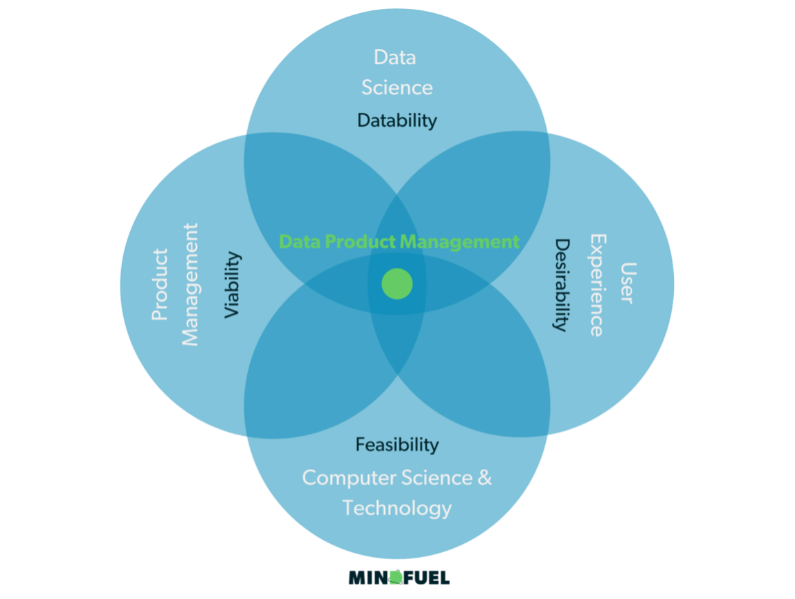

이 글은 [작성자 블로그](https://yongsquant.github.io/)에서도 보실 수 있습니다.

이 글은 아래 미디엄 블로그의 글을 번역하였습니다.
([원문](https://towardsdatascience.com/data-product-management-ffa582f7e047))
인공지능과 머신러닝의 최근 적용 사례를 보고 있자면 매우 큰 단절이 관찰되고 있는 것 같습니다. 실리콘 밸리의 빅테크 기업과 같은 한쪽에서는 머신러닝ㅇ르 적용하는 것이 매우 당연한 것으로 여겨집니다. 사실인즉슨, 우버나 에어비앤비, Zalando, 심지어 틱톡과 같은 회사들은 머신러닝이 없이는 기능할 수조차 없습니다. 다른 한편으로는, 규모가 큰 전통적 대기업들이 코로나19의 한가운데에서 AI기술들에 대한 투자를 대폭 늘였지만, 실질적으로는 의미있는 결과를 얻지 못하는 경우도 발생하고 있습니다. 대부분의 머신러닝 프로젝트는 실제 제품화 되지 못하고 PoC(Proof of Concept : 가능성 증명단계)단계에 머무르고 있습니다. 연구에 따르면 대략 이 비율은 80%에서 90%에 달합니다.
 
이런 "전통적인" 대기업들에서 프로젝트의 실패가 높고, 의미가 적은 결과로 이어지는 이유는 무엇일까요. 분명 많은 이유들이 있을 것입니다. 예를 들면 실제로 재능있는 데이터 과학자의 부족이라던지, 신기술의 적용 부재, 그리고 IT 레거시가 적고, 모든 제품이 디지털 기반인 테크회사들보다는 성공시키기가 더 어려울 것입니다. 하지만 무엇보다도, 가장 쉽게 발견되는 이유는 'AI 제품 마인드셋'의 부족일 것입니다. 많은 AI 기획에 있어서 쉽게 부재하는 것은, AI 제품의 특성 자체가 기획의 초기단계에서 그 기획이 유저들에게 실제로 어떤 가치를 부여할 수 있을지를 정확하게 알기 어렵다는 이유로 그것들이 간과되기 때문입니다. 
 
이러한 어려움은 아래에서처럼 현대 조직의 두 집단 모두에서 발생하고 있습니다.

첫째로, 데이터 과학자 혹은 AI 전문가들은 기술적인 역량을 보유하고 있지만 디지털 프로덕트 혹은 프로젝트 매니지먼트에 대한 이해는 부족합니다.
 
두번째로, 프로덕트 매니저들은 데이터 프로덕트에 대한 고유한 요건들과 머신러닝이 어떻게 개발되는지에 대해서 이해할 필요가 있습니다. 왜냐하면 머신러닝 기능들은 향후에 어떤 방식으로든 디지털 프로덕트와 밀접한 관련을 가지게 될 것이기 때문입니다.
 
그래서 이것을 주장하려고 합니다. Data-Driven 프로덕틔 성공을 위해서는 이 분야에 특화되어서 훈련된 역할이 필요하며 이것을 Data Product Manager라고 부르겠습니다. 
결국, 사용자는 머신러닝의 정확도가 90%이든 95%이든 궁금하지 않습니다. 결국 자신의 요구와 문제를 해결해주었는지만을 궁금해할 뿐입니다. 
 
"전통적인" 대기업들은 많은 프로젝트들로 구성되어 있습니다. 제 아무리 "데이터 프로덕트"라는 목표를 가졌다고 하더라도 말입니다. 그들은 그 기업들에서 익숙한 프로세스를 따릅니다 - 제한된 예산과 제한된 타임라인 안에서 미리 정의된 요구사항들을 만족시키는 것들이 그것입니다. 프로젝트는 목적했던 요구사항이 달성되었을 때 성공으로 간주됩니다. 머신러닝의 경우에 처음에 설정했던 목표 - 예를 들면 정확도 xx% 가 달성되었을 때 - 성공하는 것입니다. 
 
이것의 어떤 부분이 잘못되었을까요? 데이터 프로덕트 매니지먼트 세계에서 이러한 프로젝트는 당신을 함정에 빠르릴 것입니다. 프로젝트 기반의 많은 데이터 기획과 개발들은 유저를 잊게 하는 위험을 늘 가지고 있습니다. 그리고 실제로 이런 위험이 노출되는 순간, 기업들은 진정으로 이 데이터 프로덕트를 비지니스 안으로 적용시키는 데에 큰 문제를 노출합니다. 그래서 최종 프로젝트는 결국 아무런 임팩트를 가지지 못한 결과가 됩니다 - 비지니스 도입의 실패, 그리고 더 나아가서 데이터 컬쳐에 아무런 도움도 되지 않은채로 말이죠.
 
당연하게도 유저 중심, 유저 기반의 AI라는 것은 전혀 특별한 것이 아닙니다. 하지만 AI에 있어서 *"제품 중심 AI 마인드셋"* 이라는 개념에 반드시 포함되어야 하는 몇 가지 속성이 있습니다.

첫번째, AI와 ML의 세계에서는, 반드시 특정한 개발단계가 지나야만 그 기능에 대한 잠재적 가능성을 제대로 예측해볼 수 있습니다. 일반적으로는 프로젝트의 필수 항목 중에서 오직 일부만을 정의할 수 있습니다. 예를 들어서, 선험적인 예상 결과, 미확정된 종료 일자, 미확정된 에산과 같은 것들입니다.

두번째,  AI 기능들은 절대로 '종료' 되거나 '완전 납품'될 수 있는 것이 아닙니다. AI기능은 점차적으로 납품되어야 하고, 결국 프로덕트 생애주기에 해당하는 운영을 요구합니다. 그래서 조직에서는 특정 제품과 마찬가지로 특정 AI기능에 특화된 팀(혹은 팀들)을 운영해야 합니다. 이 팀은 제품의 지속적인 개발 뿐만 아니라 조직 내부로 제품이 완전하게 정착하는 것을 목표로 하는 팀이어야 합니다. 

세번째로, 데이터 프로덕트의 가치를 완전히 뽑아내기 위해서는 이것들이 좀 더 큰 에코시스템 안으로 편입되어야 합니다. 예를 들면 디지털 프로덕트 혹은 디지털 플랫폼과 같은 구성 안으로 들어가야 합니다. 특정 기능이 에코시스템 안으로 자연스럽게 스며들수 있게끔 노력하는 것은 디지털 프로덕트 매니지먼트의 아주 자연스러운 업무입니다.

요약하자면 AI의 개발과 머신러닝 솔루션과 같은 것들이 성공하기 위해서는 '진짜 제품'이어 햡나다. '제품' 이라고 한다면, 사용자들을 위한 노출되는 기능 뿐만 아니라 조직 내부에서 데이터를 기반으로 가치를 창출하거나 편의를 제공하기 위한 기능이나 모델, 서비스와 같은 것들을 모두 포함하는 것입니다.

--- 
####데이터 프로덕트 매니저 - 가치 창출을 위한 프로세스 담당자
데이터 싸이언스 팀과 일하기 시작하면 AI와 ML이라는 것이 결국 이들이 결국 공학자 혹은 과학자 직군이라는 것을 금새 알 수 있을 것입니다. 데이터 과학자들이나 ML엔지니어들은 그들이 개발하고자 하는 기능에 대해서 기술적인 구현가능성에만 집중하게 됩니다.  이런 관점에서의 접근은 성공에 관한 다른 요소들을 쉽게 경시하기도 합니다. 예를 들면 어떤 비지니스 사례들에 대한 중요성이나 유저나 사용자들이 진정으로 무엇을 원하는지를 생각하지 않는 것들이죠. 

비지니스 관점과 유저의 관점에서 기능이나 솔루션을 생각해보는 것이야말로 프로덕트 매니지먼트의 모든 것이라고 할 수 있을 것입니다. 프로덕트 매니지먼트는 전통적으로 다음의 세 가지 덕목을 경전처럼 외우고 다닙니다. 그것들은 Feasibility(타당성), Viability(실현 가능성), 그리고 Desirability(적합성). 각 덕목은 다른 스킬셋과 방법론들을 필요로 하지만 이 세 덕목의 조합은 제품의 성공과 비지니스 가치를 결정 짓는 것들입니다. 

데이터 프로덕트에 있어서 세 가지 덕목에 더해서 하나가 더 필요하다는 것은 명확합니다. 그것은 바로 Datability(데이터가능성)입니다. 이 덕목은 매우 견고한 데이터 분야에 대한 이해를 기초로 하고 있습니다. Datability 관점에서는 제품에 관한 아이디어에 대하여 데이터의 잠재력을 확인하는 과정에서 위 세가지 덕목들을 함께 고려하게 됩니다. 따라서 이 네가지 덕목들이 합쳐질때 데이터 프로덕트는 개념화되고, 디자인되고, 제대로 실현될 수 있게 되는 것입니다. 

#### AI 제품을 만들기 위한 제대로 된 팀 구성
자 이제, 최고의 AI 제품팀을 만들어 봅시다. 유저와 고객에게 가치를 제공하기 위해서 우리는 이 제품이 녹아들어가야하는 최적의 환경이 필요합니다. 이 제품을 디지털 플랫폼이나 디지털 프로덕트라고 보면 될까요? 혹은 특정한 목적에 국한되는 단독 서비스- 예를 들면 대시보드라던지 - 의 형태이면 될까요? 아니면 마이크로서비스로써 개발팀의 환경속으로 들어가면 될까요?
한번 이 경우에는 디지털 프로덕트라고 해봅시다. 이 경우라면 프로덕트팀(PM팀)과 매우 밀접한 관계를 가지게 될것입니다. 그리고 다음과 같은 팀 구성을 필요로 할 것입니다. 

1. Data Product Manager
2. Data Product Owner
3. UX Designer
4. Data Scientist(데이터과학자)
5. ML Engineer(머신러닝 엔지니어)
6. Data Engineer(데이터 엔지니어)
7. DevOps Engineer(데브옵스)

#### 제품 관점으로 AI제품을 만들기 위한 프로세스를 진정으로 실행시키기
결과가 아니라 가치와 의미(Not Ouput, Outcome)를 만들기 위해서는 큰 도약을 해야합니다. 제품 관점으로 접근하기 위해서 저는 세가지 간단한 것들을 제시해보려고 합니다. 
1. 당신이 만들고 싶은 가치와 의미에 대해서 정확하게 이름을 붙여보고 정의해봅시다 : 원하는 가치에 대해서 먼저 토론해보아야 합니다. 
2. 활동 관점에서 팀 구성에 대해 평가해봅시다: 개별 제품에 있어서 다른 기술과 역할들이 요구될 수 있습니다.하지만 당신의 팀이 해야하는 활동들은 늘 동일해야 합니다. 예를들어서 작은 프로덕트라면 데이터 과학자는 ML 엔지니어의 역할을 커버할 수 있습니다. 혹은 Product Owner가 Data Product Manager의 역할을 커버할 수도 있습니다.
3. 데이터 프로덕트 생애주기와 운영에 대하여 설계하고 공유합시다: 진짜 작업은 데이터 프로덕트가 개발되는 스프린트가 아니라 실제로 유저와 고객을 대상으로 이 서비스가 시작된 다음부터 입니다. 유저와 고객으로부터 얻은 피드백은 제품의 다음 단계로의 성장을 위해서 매우 중요한 정보입니다. 이 생애주기 관리에 대한 전문성이 바로 당신의 제품이 지속적으로 창조되는 과정과 이 제품이 어떻게 인식될 것인지에 대해서 매우 중요한 영향을 미칠 것입니다. 
   
다양한 방법과 수단들을 모두 사용해서 결국 가치와 결과를 만들어내는 AI제품의 생애주기를 완성할 때에야 말로 AI제품에 관한 제품 관점(mindset)은 자연스럽게 찾아올 것입니다. 그리고 데이터 프로덕트의 성공이 무르익어 갈 것입니다. 그리고 결국에는, 유저와 사용자들이 그 결과의 과실과 열매를 누리는 것이겠죠.