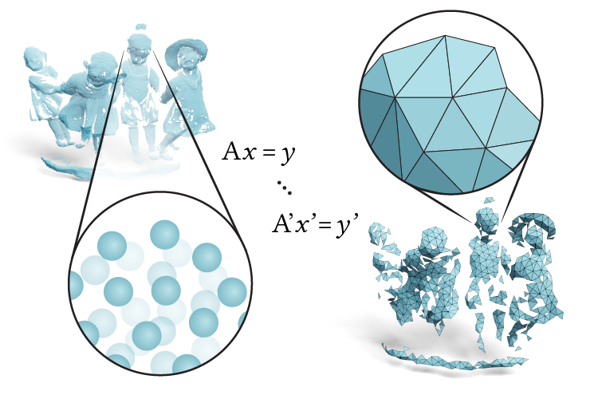

## SIGGRAPH 2023
# A Fast Geometric Multigrid Method for Curved Surfaces
[Ruben Wiersma](https://rubenwiersma.nl/)<sup>1</sup>, [Ahmad Nasikun](https://graphics.tudelft.nl/ahmad-nasikun/)<sup>1, 2</sup> (equal contribution); [Elmar Eisemann](http://graphics.tudelft.nl/~eisemann/)<sup>1</sup>; and [Klaus Hildebrandt](http://graphics.tudelft.nl/~klaus/)<sup>1</sup><br />
<sup>1</sup>Delft University of Technology, <sup>2</sup>Universitas Gadjah Mada



<a id="github-link"
      class="icon" title="Gravo MG Github Repo" aria-label="Github Project"
      href="https://graphics.tudelft.nl/gravo_mg" target="_blank">
    <i class="fa fa-2x fa-github"></i> Code</a>&nbsp;&nbsp;
<a id="pdf-link"
      class="icon" title="Gravo MG PDF" aria-label="PDF link"
      href="https://graphics.tudelft.nl/~klaus/papers/Gravo_MG.pdf" target="_blank">
    <i class="fa fa-2x fa-file-pdf-o"></i> Paper PDF</a>&nbsp;&nbsp;
<a id="pdf-link"
      class="icon" title="Gravo MG supplement PDF" aria-label="PDF link"
      href="https://graphics.tudelft.nl/~klaus/papers/Gravo_MG_suppMat.pdf" target="_blank">
    <i class="fa fa-2x fa-file-pdf-o"></i> Supplement PDF</a>&nbsp;&nbsp;
<a id="cite-link"
      class="icon" title="Cite" aria-label="Cite"
      href="#cite">
    <i class="fa fa-2x fa-quote-right"></i> Cite</a>&nbsp;&nbsp;

## Abstract
We introduce a geometric multigrid method for solving linear systems arising from variational problems on surfaces in geometry processing, Gravo MG. Our scheme uses point clouds as a reduced representation of the levels of the multigrid hierarchy to achieve a fast hierarchy construction and to extend the applicability of the method from triangle meshes to other surface representations like point clouds, nonmanifold meshes, and polygonal meshes. To build the prolongation operators, we associate each point of the hierarchy to a triangle constructed from points in the next coarser level. We obtain well-shaped candidate triangles by computing graph Voronoi diagrams centered around the coarse points and determining neighboring Voronoi cells. Our selection of triangles ensures that the connections of each point to points at adjacent coarser and finer levels are balanced in the tangential directions. As a result, we obtain sparse prolongation matrices with three entries per row and fast convergence of the solver.

## Learn more

Find out more about DeltaConv in our paper, or come see our (virtual) presentation at SIGGRAPH 2023.

<a id="github-link"
      class="icon" title="Gravo MG Github Repo" aria-label="Github Project"
      href="https://graphics.tudelft.nl/gravo_mg" target="_blank">
    <i class="fa fa-2x fa-github"></i> Code</a>&nbsp;&nbsp;
<a id="pdf-link"
      class="icon" title="Gravo MG PDF" aria-label="PDF link"
      href="https://graphics.tudelft.nl/~klaus/papers/Gravo_MG.pdf" target="_blank">
    <i class="fa fa-2x fa-file-pdf-o"></i> Paper PDF</a>&nbsp;&nbsp;
<a id="pdf-link"
      class="icon" title="Gravo MG supplement PDF" aria-label="PDF link"
      href="https://graphics.tudelft.nl/~klaus/papers/Gravo_MG_suppMat.pdf" target="_blank">
    <i class="fa fa-2x fa-file-pdf-o"></i> Supplement PDF</a>&nbsp;&nbsp;
<a id="cite-link"
      class="icon" title="Cite" aria-label="Cite"
      href="#cite">
    <i class="fa fa-2x fa-quote-right"></i> Cite</a>&nbsp;&nbsp;

## Contact
r.t.wiersma [at] tudelft.nl, k.a.hildebrandt [at] tudelft.nl

<a href="http://graphics.tudelft.nl" target="_blank">Computer Graphics and Visualization group TU Delft</a>

## Cite
```
@Article{WiersmaNasikun2023GravoMG,
  author    = {Ruben Wiersma, Ahmad Nasikun, Elmar Eisemann, Klaus Hildebrandt},
  journal   = {SIGGRAPH 2023},
  title     = {A Fast Geometric Multigrid Method for Curved Surfaces},
  year      = {2023},
  month     = jul,
  number    = {4},
  volume    = {41},
  doi       = {10.1145/3588432.3591502},
  publisher = {ACM}
}
```
