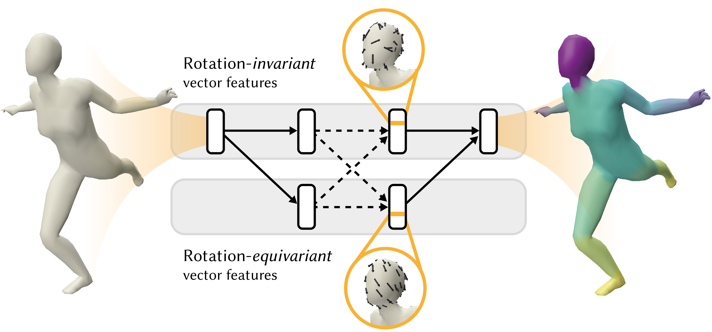

## SIGGRAPH 2020
# CNNs on Surfaces using Rotation-Equivariant Features
[Ruben Wiersma](https://rubenwiersma.nl/), [Elmar Eisemann](http://graphics.tudelft.nl/~eisemann/), and [Klaus Hildebrandt](http://graphics.tudelft.nl/~klaus/)<br />
Delft University of Technology



<a id="github-link"
      class="icon" title="HSN Github Repo" aria-label="Github Project"
      href="https://github.com/rubenwiersma/hsn" target="_blank">
    <i class="fa fa-2x fa-github"></i> Code + datasets</a>&nbsp;&nbsp;&nbsp;&nbsp;
<a id="pdf-link"
      class="icon" title="HSN PDF" aria-label="PDF link"
      href="#" target="_blank">
    <i class="fa fa-2x fa-file-pdf-o"></i> Paper PDF</a>&nbsp;&nbsp;&nbsp;&nbsp;
<a id="pdf-link"
      class="icon" title="Cite" aria-label="Cite"
      href="#cite">
    <i class="fa fa-2x fa-quote-right"></i> Cite</a>

## Abstract
This paper is concerned with a fundamental problem in geometric deep learning that arises in the construction of convolutional neural networks on surfaces. Due to curvature, the transport of filter kernels on surfaces results in a rotational ambiguity, which prevents a uniform alignment of these kernels on the surface. We propose a network architecture for surfaces that consists of vector-valued, rotation-equivariant features. The equivariance property makes it possible to locally align features, which were computed in arbitrary coordinate systems, when aggregating features in a convolution layer. The resulting network is agnostic to the choices of coordinate systems for the tangent spaces on the surface. We implement our approach for triangle meshes. Based on circular harmonic functions, we introduce convolution filters for meshes that are rotation-equivariant at the discrete level. We evaluate the resulting networks on shape correspondence and shape classifications tasks and compare their performance to other approaches.

## Contact
r.t.wiersma [at] tudelft.nl, k.a.hildebrandt [at] tudelft.nl

## Cite
```
@Article{Wiersma2020,
  author    = {Ruben Wiersma, Elmar Eisemann, Klaus Hildebrandt},
  journal   = {Transactions on Graphics},
  title     = {CNNs on Surfaces using Rotation-Equivariant Features},
  year      = {2020},
  month     = jul,
  number    = {4},
  volume    = {39},
  doi       = {10.1145/3386569.3392437},
  publisher = {ACM},
}
```
