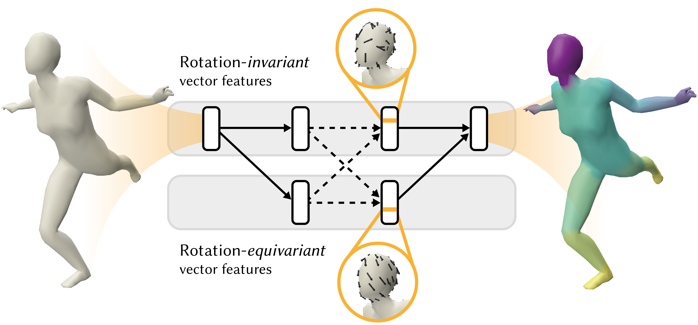

## SIGGRAPH 2020
# CNNs on Surfaces using Rotation-Equivariant Features
[Ruben Wiersma](https://rubenwiersma.nl/), [Elmar Eisemann](http://graphics.tudelft.nl/~eisemann/), and [Klaus Hildebrandt](http://graphics.tudelft.nl/~klaus/)<br />
Delft University of Technology




<a id="github-link"
      class="icon" title="HSN Github Repo" aria-label="Github Project"
      href="https://github.com/rubenwiersma/hsn" target="_blank">
    <i class="fa fa-2x fa-github"></i> Code + datasets</a>&nbsp;&nbsp;
<a id="presentation-link"
      class="icon" title="HSN Presentation" aria-label="Presentation"
      href="https://youtu.be/kg1wRBGUYqk" target="_blank">
    <i class="fa fa-2x fa-film"></i> Presentation</a>&nbsp;&nbsp;
<a id="pdf-link"
      class="icon" title="HSN PDF" aria-label="PDF link"
      href="/assets/pdf/CNNs_Surfaces_Rotation_Equivariant_Features.pdf" target="_blank">
    <i class="fa fa-2x fa-file-pdf-o"></i> Paper PDF</a>&nbsp;&nbsp;
<a id="pdf-link"
      class="icon" title="Cite" aria-label="Cite"
      href="#cite">
    <i class="fa fa-2x fa-quote-right"></i> Cite</a>

## Abstract
This paper is concerned with a fundamental problem in geometric deep learning that arises in the construction of convolutional neural networks on surfaces. Due to curvature, the transport of filter kernels on surfaces results in a rotational ambiguity, which prevents a uniform alignment of these kernels on the surface. We propose a network architecture for surfaces that consists of vector-valued, rotation-equivariant features. The equivariance property makes it possible to locally align features, which were computed in arbitrary coordinate systems, when aggregating features in a convolution layer. The resulting network is agnostic to the choices of coordinate systems for the tangent spaces on the surface. We implement our approach for triangle meshes. Based on circular harmonic functions, we introduce convolution filters for meshes that are rotation-equivariant at the discrete level. We evaluate the resulting networks on shape correspondence and shape classifications tasks and compare their performance to other approaches.

## Summary

### Rotation ambiguity

<p>After the succes of deep learning on images, researchers have worked to generalise deep learning to graphs and manifolds. One of the approaches for manifolds is based on charting. Charting-based methods learn a kernel in the tangent plane, and apply it to a surface with a mapping, like the Riemannian exponential map (chart).<br /><br />Each of these charting-based methods faces the problem that there is no global coordinate system to align filters to in the tangent plane. We call this problem <i>rotation ambiguity</i>.</p>

### Different locations, different rotations

Previous approaches either solve rotation ambiguity by aligning kernels to a smoothed field (e.g., principal curvature direction), or applying the kernel at multiple directions and taking the maximum activation within or at the end of the network. The latter seems inefficient, since the network has to compute and store multiple rotated copies of each kernel. Both approaches have a hard time accurately relating points that lie further away from each other, as the difference between coordinate systems grows.


### Our solution
Inspired by research on rotation-invariant learning on images [Worrall et al. 2017], we provide a fundamental solution to the rotation ambiguity problem by restricting our kernels to circular harmonics. The resulting complex features are organized in streams of rotation order (see teaser image). Our networks employ rotation orders 0, being rotation-invariant (left), and 1, being rotation-equivariant (right).


The result is a network that is invariant to choices of coordinate systems within the tangent plane.

### Parallel transport

But wait, rotation-equivariant features are encoded using a coordinate system and this encoding changes with the chosen coordinate system. We correctly propagate these features with parallel transport along shortest geodesics. This transport amounts to a rotation, which can be directly applied to the rotation-equivariant features.


## Results

We evaluated our network on multiple tasks (classification, segmentation, correspondence) using a U-ResNet architecture (see the paper for details). The results show improved performance.


By visualising the features as tangent vectors on the surface, we get a glimpse into what our network learns. These features from the rotation-equivariant stream in the second-to-last layer clearly activate on legs and hands, irregardless of deformation:


## Learn more

Find out more about our technique in our paper, or come see our (virtual) presentation at SIGGRAPH 2020.

<a id="github-link"
      class="icon" title="HSN Github Repo" aria-label="Github Project"
      href="https://github.com/rubenwiersma/hsn" target="_blank">
    <i class="fa fa-2x fa-github"></i> Code + datasets</a>&nbsp;&nbsp;
<a id="presentation-link"
      class="icon" title="HSN Presentation" aria-label="Presentation"
      href="https://youtu.be/kg1wRBGUYqk" target="_blank">
    <i class="fa fa-2x fa-film"></i> Presentation</a>&nbsp;&nbsp;
<a id="pdf-link"
      class="icon" title="HSN PDF" aria-label="PDF link"
      href="/assets/pdf/CNNs_Surfaces_Rotation_Equivariant_Features.pdf" target="_blank">
    <i class="fa fa-2x fa-file-pdf-o"></i> Paper PDF</a>&nbsp;&nbsp;
<a id="pdf-link"
      class="icon" title="Cite" aria-label="Cite"
      href="#cite">
    <i class="fa fa-2x fa-quote-right"></i> Cite</a>
## Contact
r.t.wiersma [at] tudelft.nl, k.a.hildebrandt [at] tudelft.nl

<a href="http://graphics.tudelft.nl" target="_blank">Computer Graphics and Visualization group TU Delft</a>

## Cite
```
@Article{Wiersma2020,
  author    = {Ruben Wiersma, Elmar Eisemann, Klaus Hildebrandt},
  journal   = {Transactions on Graphics},
  title     = {CNNs on Surfaces using Rotation-Equivariant Features},
  year      = {2020},
  month     = jul,
  number    = {4},
  volume    = {39},
  doi       = {10.1145/3386569.3392437},
  publisher = {ACM},
}
```
