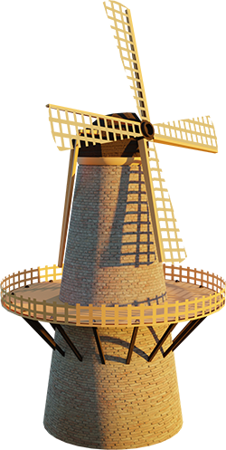
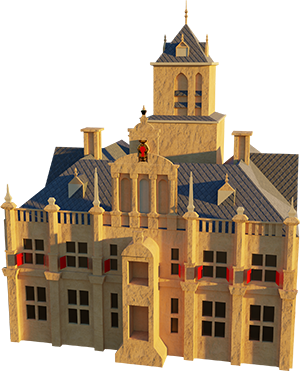
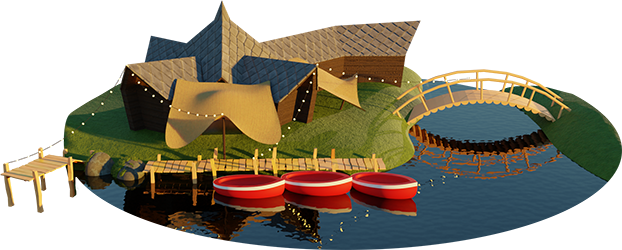

## RUBEN  JOANNE
# Op 30 september 2022 hopen we te trouwen en dat vieren we graag met jou!

### Programma

<a href="https://www.bijderoos.nl" target="_blank">**Molen de Roos -- Daggasten**</a> 
**Phoenixstraat 111-112, 2611 AK Delft** 
Start dag - 10:00 
Brunch - 11:30 

<a href="https://www.delft.nl" target="_blank">**Stadhuis Delft**</a> 
**Markt 87, 2611 GS Delft** 
Ceremonie - 14:30

<a href="https://www.knus.nl/" target="_blank">**Knus**</a> 
**Zavelpad 3, 2616 LH Delft** 
Receptie - 20:30 
Feest - 22:30 
Afscheid - 1:00

### Cadeautips
Je kan cadeautips vinden op <a href="https://www.lijstje.nl/rubenenjoanne" target="_blank">https://www.lijstje.nl/rubenenjoanne</a>.
Als je graag bij wil dragen aan een cadeau, maar 

### Contact
Je kan ons bereiken via <a href="mailto:rubenenjoanne@gmail.com">rubenenjoanne@gmail.com</a>. We vinden stukjes en speeches leuk! Jullie kunnen doorgeven als jullie dat van plan zijn aan de ceremoniemeesters: 
Vivian Vriend 
Florida Visser
